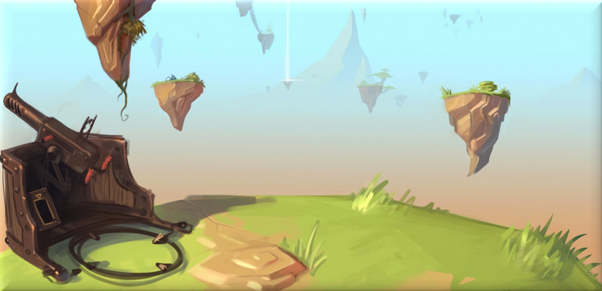

**Instructions:**
- Clone ce repo ou tu veux mettre ton dossier de projet Unity, le nom du dossier crée par le clone sera "VRBI"
- Ouvre unity en choisissant comme projet ce dossier.
- Install les plugins requis pour le projet (*).
- Redemarre Unity. Voila.

**Plugins:**
- Importe Playmaker depuis le store, puis installe l'editeur dans les dossiers.
- Importe SteamVR depuis le store.
